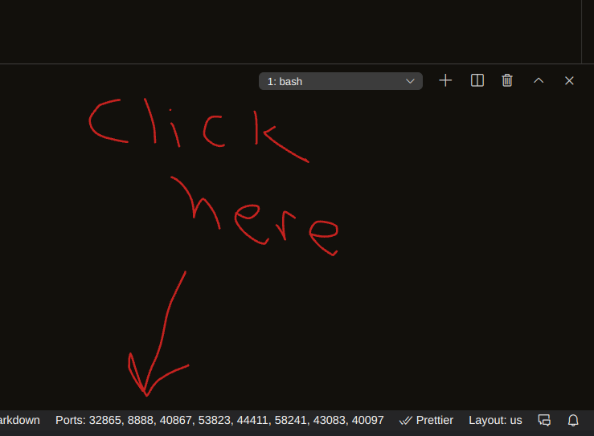

# generic-gitpod-for-data-science

So, in theory, this will all work peachy-keen. You need to:

1. Open this repo on gitpod with the button.
2. Update `.gitpod.yml`, changing the name of the file path for jupyter. `nohup jupyter notebook --config=/workspace/<your project>/.jupyter/jupyter_notebook_config.py`
3. Click the `Ports:` thing down on the bottom of the screen (see SS below).
4. Click the globe on port `8888` on the thing that pops up on the right hand side. Refresh the page a time or two if it doesn't show up right away.
5. Enter `bill` (use the space bar for the spaces) as the password.

_*Optional*_

- run `jupyter trust shiturgonnarun.ipynb` before you start the server.
- In the terminal, run `jupyter notebook password`. Enter `bill is the greatest` (you can enter whatever you want for a password, don't need to do that).
- Git clone down whatever project you want to work on.
  - For example, `git clone https://github.com/forethinklabs/enron-emails.git`.
  - ~~You can work without it starting from this repo and pulling down a different one, but if you _really_ want the jupyter experience you'll need to do this. **this likely will be how a Dash App is shared as well!**~~
    - Update (2021-05-11): This now also works for dash. I've included a minimal dash file, which is started `nohup python app.py &`.

_*N.B.*_

- ~~Do _not_ turn on the python extension on VS code, if you want this to work. You may need to initially start the instance, turn off the extension, stop the instance, and then create a new one.~~
  - (5/2/21 update) this may not be true, need to test.
  - (2021-05-11 update): this is false, you can leave the python extension on.

_*N.B.*_ to the previous

- This should stop being a problem when we self-host.

